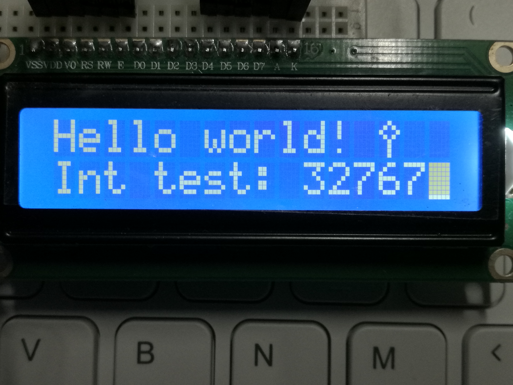
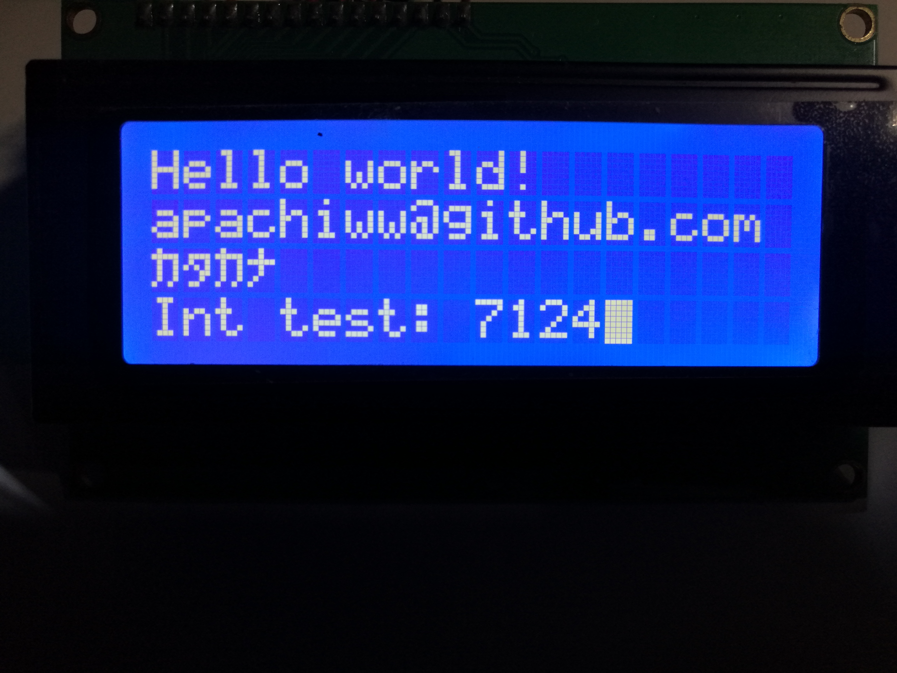

# HD44780 library for sdcc 51

This library provides support for HITACHI HD44780 based character LCDs (0801, 0802, 1601, 1602, 2004) and some compatible VFD variants like Noritake itron CU20045 (Light adjust available), with fast IO operation

+ Suitable for 8051 based MCUs with various crystals and instruction cycles (1T, 6T, 12T) as AUTOMATIC delay calculation is available

+ Both 4-bit and 8-bit bus modes are supported

+ カタカナ display and CGRAM operations also available

This library is designed for SDCC only, IO definitions should be modified accordingly if you are to apply it to Keil C51

**Note**: During the LCD initialization, it's recommended to use disp_start_stable() rather than disp_start() 

See test [examples](examples/)

## Test 1: LCD1602 using 4bit bus with R/#W

## Test 2: LCD2004 using 4bit bus with R/#W

