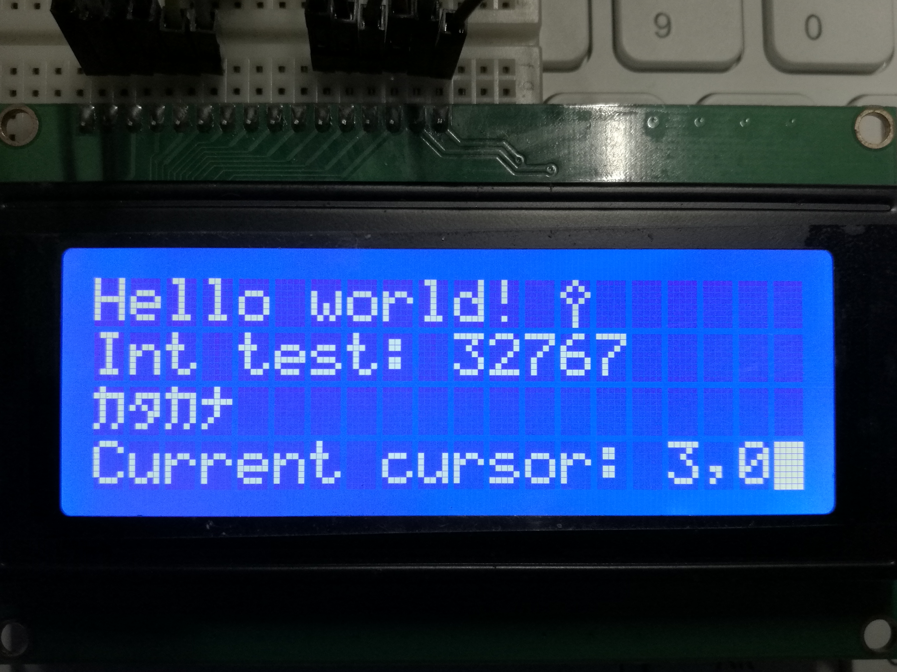

# HD44780 library for sdcc 51

This library provides support for HITACHI HD44780 based character LCDs (0801, 0802, 1601, 1602, 2004) and some compatible VFD variants like Noritake itron CU20045 (Light adjust available), with fast IO operation

+ Suitable for 8051 based MCUs with various crystals and instruction cycles (1T, 6T, 12T) as AUTOMATIC delay calculation is available

+ 4bit or 8bit M68 and i80 interface supported

+ カタカナ display (MACRO defined) and CGRAM operations also available

+ Easy-to-use formattable print function `disp_printf(format, ...)` similar to normal `printf(format, ...)`

> Usage:
>
> 1. Add both `hd44780.c` and `hd44780.h` to your project
>
> 2. Modify the configurations accordingly in `hd44780.h`
>
> 3. Include `hd44780.h` in your main.c
>
> 4. There are three types of functions operating at different levels. It's recommended to use the high level functions. Look them up at the end of `hd44780.h`

This library is designed for SDCC only

See test [examples](examples/)

## Test with LCD1602

4bit M68 interface with R/#W

## Test with LCD2004

4bit M68 interface with R/#W

## Test with Noritake CU20045-UW VFD

8bit M68 interface with R/#W

## Test with PT6314 based VFM202MDAR2 VFD 

8bit i80 interface with #RD

